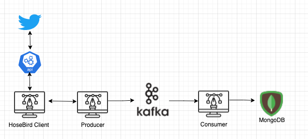
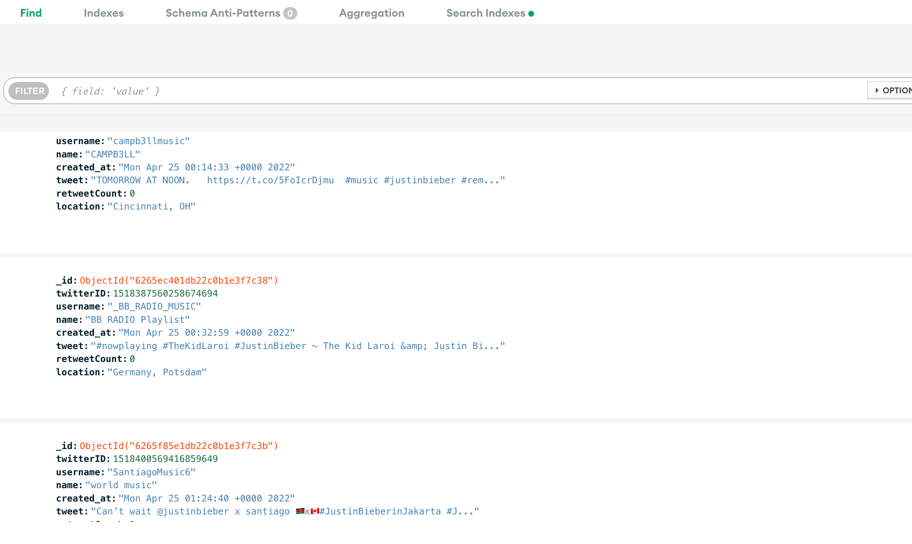
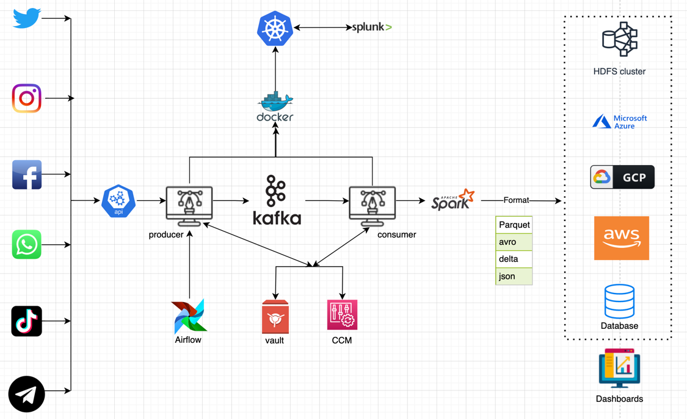

# twitter-streaming

###Goal

Build a data pipeline connecting to the Twitter streaming API by doing keyword search on Justin Beiber
and filter out all tweets having to do with music and store the tweets in a database by avoiding duplicates,
count of all tweets consumed along with unique tweets

I have used <a href="https://github.com/twitter/hbc">Twitter Hosebird Client</a> which provides OAuth support,
Partitioning , Automatic reconnections with appropriate backfill counts , access to raw bytes payload and
Proper backoffs/retry schemes etc.

### Requirements

- Java 8
- Maven
- Kafka

### Initital Instructions
Clone below repositories and install all dependencies.

<a href="">Kafka producer</a> : Filter the tweets on filter criteria and send them to kafka topic.

<a href="">Kafka consumer</a> : Read the tweets from kafka topic and save them in MongoDB.

1. Create a <a href="https://developer.twitter.com/en/apps">developer account</a> to generate the necessary secret keys. Include the generated keys in  Twitter class.
2. Install kafka in your machine using the command "brew install kafka" or follow instructions in apache kafka official website.
3. I am using MongoDB to store my tweets . In order to have a connection url we can utilize the <a href="https://account.mongodb.com/account/register">free tier</a>
   offered by mongoDB by following the instructions <a href="https://www.knowi.com/blog/getting-started-with-mongodb-atlas-overview-and-tutorial/">here</a>.
4. Add your computer IP address to MongoDB whitelist IP section in order to avoid  connection rejections when you try to connect your local environment to cloud MongoDB instance.

### Run the Application


In order to send tweets to the producer we have to start Zookeeper and Kafka.

```shell
# Start Zookeeper
$ zookeeper-server-start /usr/local/etc/kafka/zookeeper.properties
```

```shell
# Start Kafka
$ kafka-server-start /usr/local/etc/kafka/server.properties
```

```shell
# Create a topic
$ kafka-topics --create --topic <YOUT TOPIC HERE> --bootstrap-server localhost:9092
```
Once the zookeeper and kafka are up and running, we need to run <a href="">TwitterProducer</a> class which will read the "#justinbieber" tweets from stream and 
filter the tweets on "music" keyword and send them to the kafka topic. Run <a href="">KafkaConsumer</a> to read from topic and save the tweets in mongoDB.

### Application Flow:



#### Output:



###Drawbacks/Risks of POC

1. Application works only for twitter in other hand we can integrate with multiple feeds from other sources .
2. User credentials are not stored properly in a safe location.
3. Kafka cluster is not available in multiple regions which leads to data loss if it goes down.
4. Data is stored in nosql DB instead we can stream data from  kafka to spark and save it any cloud which gives performance and more options for the customer.
5. Configurations are stored in class instead we can go for configuration management.
6. Application is triggered manually instead we can configure in Airflow or any other scheduling tool.
7. Alerts and dashboards are not created, this will be a problem when you have a production issue.

### proof-of-concept to a production-ready:



####Rollout process:
1. Develop code along with  unit tests and data quality checks.
2. Configure passwords to store in vault and configurations in CCM.
3. Create spotlight alerts or xmatter alerts on critical flows.
4. Integrate with CI/CD pipeline where a docker image can be deployed to kubernetes cluster.
5. Create a kafka cluster in primary and secondary regions( High availability and Disaster recovery ).
6. Create jobs in Airflow  scheduler.
7. Test the data ingestion flow and open it for integration testing.
8. prepare for production deployment, inform business partners, downstream teams on the data availability.
9. Create splunk dashboards.
10. Go for production deployment.
11. Documentation including data pipeline details and support information etc.

### Level of Effort

Proposed data pipeline gather data from multiple datapoints which will eventually be used by users or ML engineering team to
analyze data and come up with data models. Either we can save all the data into datalake or segregate each feed into separate
location. There are multiple unknowns like resources, dependencies etc. 


### Estimate timeline
Timeline  depends on several factors as listed below.
```
a) Volume  and frequency of loading the data.
b) Any transformations needed on the raw data we received.
c) Number of downstream consumers and their requests.
d) Number of jobs to be created(ex : staging -> raw -> transform -> final output)
```
